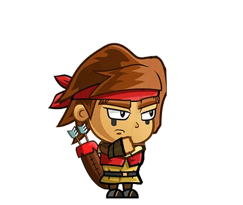
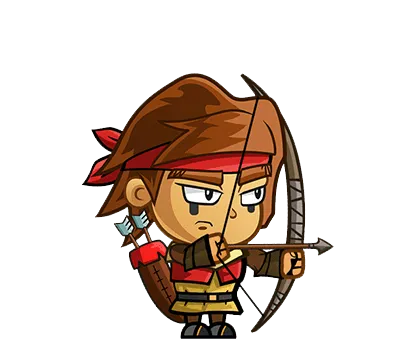
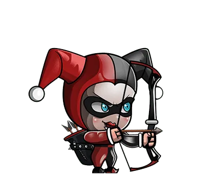

# Bow and Arrow Game

<p align="center">
  
</p>

Welcome to the Bow and Arrow challenge – an exciting game that tests your precision,
speed, and strategic thinking! In this game, you'll step into the shoes of an archer with
the mission to pop colorful balloons using your bow and arrow. Are you up for the
challenge?

## Introduction
Welcome to the Bow and Arrow Challenge!

Prepare to immerse yourself in an exhilarating adventure that combines precision, speed, and strategic thinking. In this game, you'll step into the shoes of a skilled archer on a mission to pop colorful balloons using your bow and arrow. 

You will face exciting challenges across multiple levels, each designed to push your abilities to the limit. From popping red balloons with constant speed to tackling tricky yellow balloons with irregular movements, every shot counts towards your score and progress.

 With a limited number of arrows at your disposal, you must manage your resources wisely, reload at the right moments, and aim true to maximize your score.

 Dive in, test your archery skills. Good luck, and may your arrows fly straight and true!


## Table of Contents

- [Introduction](#Introduction)
- [Controls](#Controls)
- [Features](#features)
- [Game play](#Game%20play)
- [Uml diagram](#uml%20diagram)
- [Scoring system](#Scoring%20system)
- [Licence](#Licence)

## Controls
                    
**Character Movement**: Move the Character by pointing the mouse cursor.  
**Right Mouse Button**: Change the Character's state from normal to ready to shoot Balloons.    
**Left Mouse Button**: While holding down the right mouse button, press the left mouse button to shoot an arrow and pop balloons.                      
There are some photos to Charcter in Normal situation and in 
Ready situation. 
   <table>
  <tr>
    <td align="center">
      
      <p>Normal Situation</p>
    </td>
    <td align="center">
      
      <p>Ready Situation</p>
    </td>
  </tr></table>

## Features
- Game Levels:
  - Level One:
    - 15 red balloons aligned next to each other.
    - Pop each balloon to progress to the next level.
  - Level Two:
    - 15 random red balloons, including 3 tricky yellow balloons.
    - Pop each balloon to progress to the next level.

- Challenges:
  - The yellow balloons have irregular speed and acceleration, providing an additional challenge.
  - Ballons are randomly placed, adding an element of surprise.
- Character selection:
  <p>
  you have 3 characters each with different bow to play with any one you want.<p>
    <table>
  <tr>
    <td align="center">
      
      <p>Human</p>
    </td>
    <td align="center">
      
      <p>Arlekina</p>
    </td>
    <td align="center">
      
      <p>Revenant</p>
    </td>
  </tr></table>

- Soundtrack and Audio Effects:

  we added sound effect when you hit ballon

- Initial Controls:

  you will start each level with 20 Arrows.

## Game play
In this game, we have a character that moves only in the y-direction, starting from a fixed point, which is the green ground of the background. They change their situation; if you click right, it appears as the Normal Situation, and if you click left, it shows the Ready Situation

```Java
void NormalSituation() {
    image(CharacterImage1, CharacterX, CharacterY-(CharacterHeight/2), CharacterWidth, CharacterHeight);
}

void ReadySituation() {
    image(CharacterImage2, CharacterX, CharacterY-(CharacterHeight/2), CharacterWidth, CharacterHeight);
}      

void UpdateY() {
    CharacterY=mouseY >=370? 370: mouseY;
}
```
The arrows in the game indicate the character's y-direction and move horizontally (in the x-direction) at a constant speed.
```Java
private float ArrowX=70;
  private float ArrowY;
float getX(){
    return ArrowX;
}

float getY(){
    return ArrowY;
}

void display() {
    image(ArrowPhoto, ArrowX, ArrowY, 100, 100);
}

void ObjectPosition() {
    if (ArrowX < (width + 5)) {
        ArrowX += 8;
    } else {
        Hide = true;
    }
}
```


In Level One, the red balloons move in the y-direction at a constant speed, with each one spaced apart from the others in the x-direction

In Level 2, there are 15 balloons, with 12 of them being red balloons. They move in the y-direction with constant speed but appear on the screen from different positions.

```Java 
// this is the parent class of balloons
public void  setBallonXLevel(float x){
    BallonXLevel=x;
  }
  public  void  setBallonYLevel(float y){
    BallonYLevel=y;
  }
  public float getBallonXLevel(){
   return BallonXLevel; 
  }
  public float getBallonYLevel(){
   return BallonYLevel; 
  }
  ```
  ```Java
  // this is the class RedBallon

class RedBallon extends Ballon {
  RedBallon(int d) {
    setBallonXLevel(getBallonXLevel() + d);
  }
   
  RedBallon(int d, float initialY) {
    setBallonXLevel(getBallonXLevel() + d);
     setBallonYLevel(initialY);
  }

  void displayBallonLevel1(PImage RedBallonPhoto) {
    image(RedBallonPhoto, getBallonXLevel(), getBallonYLevel(), 80, 80);
  }

  void UpdateBallonLevel2() {
    this.UpdateBallonLevel1();
  }

    void UpdateBallonLevel1() {
     super.setBallonYLevel((getBallonYLevel() -2 ) < - 90 ? 350 : (getBallonYLevel() - 2));
  } 
  
  }
```
And there are 3 yellow balloons; they move in the y-direction at different speeds and accelerations, adding an extra challenge to Level 2


In the game, if you lose in level 1, you will try level 1 again. If you win, you will proceed to level 2. If you lose in level 2, you will retry level 2 again and not return to level 1


## Uml diagram

- 
