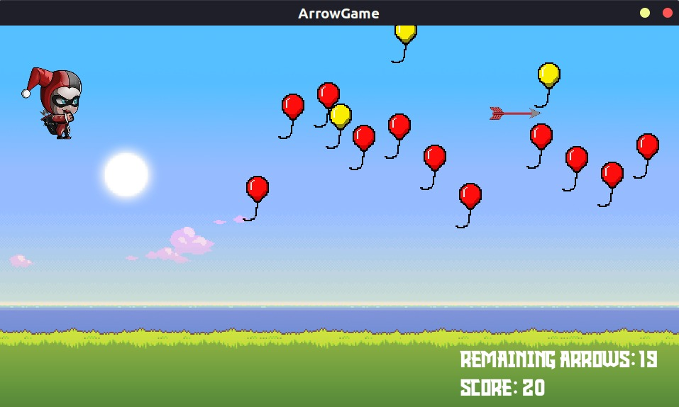

# Bow and Arrow Game

  

Welcome to the Bow and Arrow challenge – an exciting game that tests your precision,
speed, and strategic thinking! In this game, you'll step into the shoes of an archer with
the mission to pop colorful balloons using your bow and arrow. Are you up for the
challenge?

## Table of Contents

- [Introduction](#Introduction)
- [Controls](#Controls)
- [Features](#features)
- [Game play](#Game%20play)
- [Uml diagram](#uml%20diagram)
- [Scoring system](#Scoring%20system)
- [Licence](#Licence)

## Controls

Brief overview of the project, its purpose, and any key features.

## Features

- List of key features or functionalities.
- Use bullet points or numbered lists.

## Uml diagram

- 
